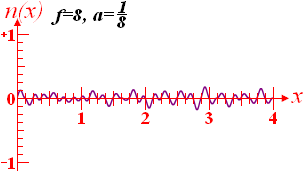
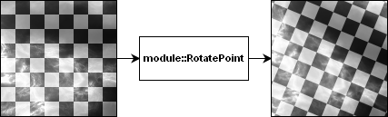

# Glossary

## Table of contents

* [Amplitude](#amplitude)
* [Coherent noise](#coherent-noise)
* [Combiner module](#combiner-module)
* [Control module](#control-module)
* [Frequency](#frequency)
* [Generator module](#generator-module)
* [Lacunarity](#lacunarity)
* [Modifier module](#modifier-module)
* [Module](#module)
* [Noise Module](#noise-module)
* [Octave](#octave)
* [Perlin noise](#perlin-noise)
* [Persistence](#persistence)
* [Selector module](#selector-module)
* [Solid noise](#solid-noise)
* [Source module](#source-module)
* [Transformer module](#transformer-module)

## Definitions

### Amplitude

The maximum absolute value that a specific [coherent-noise](#coherent-noise)
function can output.

In libnoise, a [coherent-noise](#coherent-noise) function with an ampltude of *
n* generates values between +n and -n, although in some cases (for example, when
generating [Perlin noise](#perlin-noise)), this is not guaranteed.

### Coherent noise

A type of smooth pseudorandom noise.

Coherent noise is generated by a coherent-noise function, which has three important properties:

1. Passing in the same input value will always return the same output value.
2. A small change in the input value will produce a small change in the output value.
3. A large change in the input value will produce a random change in the output value.

An n-dimensional coherent-noise function requires an n-dimensional input value. Its output value is always a scalar.

In libnoise, all coherent-noise functions are three-dimensional. Three-dimensional coherent noise is often
called [solid noise](#solid-noise)
because it can be used to create solid three-dimensional textures.

The following graph shows the output of a one-dimensional coherent-noise function n(x) with a [frequency](#frequency) of
2:

Compare it to the following graph that shows the output of a non-coherent-noise function n(x):

### Combiner module

A [noise module](#noise-module) that mathematically combines the output values from two or more source modules together.

Examples of combiner modules include:

* `noise::module::Add` — Adds the two output values from two [source modules](#source-module).
* `noise::module::Max` — Outputs the larger of the two output values from two [source modules](#source-module).

The following image demonstrates the noise::module::Add noise module, a type of combiner module.

### Control module

A [noise module](#noise-module) that indicates how to combine the output values from
the [source modules](#source-module) that are connected to a [selector module](#selector-module).

### Frequency

The number of cycles per unit length that a specific coherent-noise function outputs.

[Coherent noise](#coherent-noise) has properties similar to that of a sine wave:

* It has periodic cycles of length 1/*f*, where *f* is its frequency.
* At the start of each cycle, it outputs a value of zero.

Unlike a sine wave, the output of a coherent-noise function may or may not cross zero during the middle of a cycle.

The following graph shows the output of a one-dimensional [coherent-noise](#coherent-noise) function *n(x)*:

In the above graph, the beginning of each cycle is shown with a circle.

The following graphs show the outputs of one-dimensional [coherent-noise](#coherent-noise) functions *n(x)* with
frequencies 2, 4, and 8. In these graphs, *f* refers to frequency.

### Generator module

A [noise module](#noise-module) that outputs a value generated by a [coherent-noise](#coherent-noise) function or some
other mathematical function.

If a generator module outputs [coherent noise](#coherent-noise), the output of this module is often
called [solid noise](#solid-noise). This is because solid noise can be used to create solid three-dimensional textures.

Examples of generator modules include:

* `noise::module::Const` — Outputs a constant value.
* `noise::module::Perlin` — Outputs a value generated by a Perlin-noise function.
* `noise::module::Voronoi` — Outputs a value generated by a Voronoi-cell function.

The following image demonstrates the noise::module::Perlin [noise module](#noise-module), a type of generator module.

### Lacunarity

A multiplier that determines how quickly the [frequency](#frequency) increases for each successive [octave](#octave) in
a [Perlin-noise](#perlin-noise) function.

The [frequency](#frequency) of each successive [octave](#octave) is equal to the product of the previous octave's
frequency and the lacunarity value.

A similar property to lacunarity is [persistence](#persistence), which modifies the octaves' [amplitudes](#amplitudes)
in a similar way.

### Modifier module

A [noise module](#noise-module) that mathematically modifies the output value from a [source module](#source-module).

Examples of modifier modules include:

* `noise::module::Curve` — Maps the output value from the [source module](#source-module) onto an arbitrary function
  curve.
* `noise::module::Invert` — Inverts the output value from the [source module](#source-module).

The following image demonstrates the `noise::module::Invert` [noise module](#noise-module), a type of modifier module.

### Module

See [noise module](#noise-module).

### Noise Module

In libnoise, an object that calculates and outputs a value given a three-dimensional input value.

All noise modules are instantiations of classes derived from the base class `noise::module::Module`.

Each noise module class uses a specific method to calculate an output value. Some of these methods include:

* Calculating a value using a [coherent-noise](#coherent-noise) function or some other mathematical function.
* Changing the output value from another noise module in various ways.
* Combining the output values from two noise modules in various ways.

Noise modules can be chained together in near-infinite ways like LEGO® bricks.

libnoise has several types of noise modules:

* [Combiner module](#combiner-module)
* [Generator module](#generator-module)
* [Modifier module](#modifier-module)
* [Selector module](#selector-module)
* [Transformer module](#transformer-module)

See also: [Source module](#source-module), [Control module](#control-module)

### Octave

One of the [coherent-noise](#coherent-noise) functions in a series of coherent-noise functions that are added together
to form [Perlin noise](#perlin-noise).

These [coherent-noise](#coherent-noise) functions are called *octaves* because each octave has, by default, double the
frequency of the previous octave. Musical tones have this property as well; a musical C tone that is one octave higher
than the previous C tone has double the frequency.

The number of octaves control the *amount of detail* of [Perlin noise](#perlin-noise). Adding more octaves increases the
detail of Perlin noise, with the added drawback of increasing the calculation time.

The following graphs show the outputs of one-dimensional [Perlin-noise](#perlin-noise) functions *n(x)* with 1, 2, 4,
and 8 octaves. In these graphs, *o* refers to the octave count.

### Perlin noise

A type of [coherent noise](#coherent-noise) that is the sum of several [coherent-noise](#coherent-noise) functions of
ever-increasing [frequencies](#frequency) and ever-decreasing [amplitudes](#amplitude).

The following graphs show the outputs of several one-dimensional coherent-noise functions *n(x)*. Each graph shows a
function with double the [frequency](#frequency) and one-half the [amplitude](#amplitude) of the function from the
previous graph. In these graphs, *f* refers to frequency and *a* refers to amplitude.

The sum of these [coherent-noise](#coherent-noise) functions result in Perlin noise.

Each [coherent-noise](#coherent-noise) function that is part of a Perlin-noise function is called an [octave](#octave).
These functions are called octaves because each function has, by default, double the frequency of the previous function;
musical tones have this property as well. Perlin noise generated with more octaves produce more detailed coherent noise,
at a cost of additional calculation time.

Perlin noise is *fractal* in nature; a zoomed-in section of Perlin noise tends to look like the original section.
Natural objects also have this property; for example, a twig from a tree resembles a branch of the tree, which in turn
resembles the original tree. Because of this property, Perlin noise is ideal for generating natural, self-similar
textures such as granite, wood, marble, and clouds. It is also ideal for generating realistic terrain.

Ken Perlin invented Perlin noise in ~1983. Because his invention is used everywhere in the special-effects industry, he
won an Academy Award®.

See also: [Lacunarity](#lacunarity), [Persistence](#persistence)

### Persistence

A multiplier that determines how quickly the [amplitudes](#amplitude) diminish for each successive [octave](#octave) in
a [Perlin-noise](#perlin-noise) function.

The [amplitude](#amplitude) of each successive [octave](#octave) is equal to the product of the previous octave's
amplitude and the persistence value. Increasing the persistence produces "rougher" [Perlin noise](#perlin-noise).

The following graphs show the outputs of five-[octave](#octave) [Perlin-noise](#perlin-noise) functions *n(x)*
with persistence values of 3/4, 1/2, and 1/4. In these graphs, *p* refers to persistence.

A similar property to persistence is [lacunarity](#lacunarity), which modifies the octaves' [frequencies](#frequency) in
a similar way.

### Seed

A value that changes the output of a [coherent-noise](#coherent-noise) function.

Seeds in [coherent-noise](#coherent-noise) functions are used in the same way as seeds in standard random-number
generators. By changing the seed of a coherent-noise function, you change its output values; however, that
function's [frequency](#frequency) and [amplitude](#amplitude) are not altered.

### Selector module

A [noise module](#noise-module) that uses the output value from a [control module](#control-module) to specify how to
combine the output values from its
[source modules](#source-module).

Examples of selector modules include:

* `noise::module::Blend` — Outputs a value that is linearly interpolated between the output values from two source
  modules; the interpolation weight is determined by the output value from the control module.
* `noise::module::Select` — Outputs the value selected from one of two source modules chosen by the output value from a
  control module.

The following image demonstrates the `noise::module::Select` [noise module](#noise-module), a type
of [selector module](#selector-module). The noise module at the bottom of this image is used as
the [control module](#control-module).

### Solid noise

A common term for three-dimensional [coherent noise](#coherent-noise).

Solid noise is often used as three-dimensional procedural textures. This is because one can "carve out" modeled objects
from solid noise, like a sculptor carving a statue from marble. Because each point in three-dimensional space has its
own [coherent-noise](#coherent-noise) value, the resulting texture does not have any warps or creases. An interesting
consequence of this property is that if one cuts a piece out of the object, the texture inside of that object will mesh
perfectly with the texture on the outside of the object.

The following image shows an object that has a solid noise texture. Note that the texture does not warp anywhere on the
object; it is uniform throughout the object. It would be very difficult to produce a non-warping two-dimensional texture
map for this object.

### Source module

A [noise module](#noise-module) that is used as a source of output values for another noise module.

For example, the [noise module](#noise-module) `noise::module::Add` outputs the sum of the two source modules connected
to it.

Each source module may also be connected to other source modules, and so on.

### Transformer module

A [noise module](#noise-module) that applies a transformation to the coordinates of the input value before retrieving
the output value from the [source module](#source-module).

Examples of transformer modules include:

* `noise::module::RotatePoint` — Rotates the coordinates of the input value around the origin before retrieving the
  output value from the [source module](#source-module).
* `noise::module::ScalePoint` — Multiplies each coordinate of the input value by a constant value before retrieving the
  output value from the [source module](#source-module).

The following image demonstrates the `noise::module::RotatePoint` [noise module](#noise-module), a type of transformer
module.

